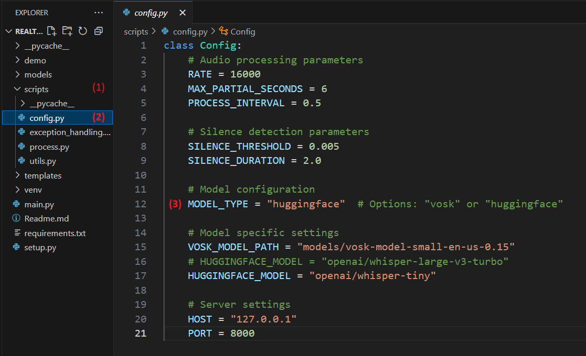

# Real-time Speech-to-Text (STT) via Websocket 🌟

A real-time **Speech-to-Text** (STT) system designed for converting spoken language into written text instantly. This project is perfect for developers looking to integrate STT functionality into their applications, offering fast, accurate, and scalable speech recognition. It streams audio from the browser microphone via WebSocket for fast, accurate transcription.

## ⚙️ Features

- Real-time Speech-to-Text Conversion: Instantly convert speech into text. 🎤➡️📜
- Optimized for Low Latency: Perfect for fast, real-time applications. ⏱️
- Audio Streaming via WebSocket: Streams audio directly from the browser microphone for live transcription. 🌐🎧
- Easy Integration: Simple to integrate and extend for various use cases. 🔧
- State-of-the-Art Models: Built using powerful models from Hugging Face and Vosk. 🧠

## 🧑‍💻 Who is this for?

This project is intended for:
- Developers building real-time transcription tools 💻
- Data scientists working with speech recognition models 📊
- Anyone interested in exploring speech-to-text technology 🔍
- Web Application Developers wanting to integrate real-time STT 🌐

---

## 🚀 Setup Guide

### 1. Clone the Repository

Start by cloning the repository to your local machine.

```bash
git clone https://github.com/huggingface/speech-to-speech.git
cd speech-to-speech
```

### 2. Set up the Virtual Environment

To keep dependencies isolated, create and activate a virtual environment.

```bash
conda create -p venv python==3.12.9 -y
conda activate venv/
```

### 3. Install Dependencies

Install **CUDA** and the necessary libraries for running the model.

```bash
pip3 install torch==2.6.0+cu118 torchvision==0.21.0+cu118 torchaudio==2.6.0+cu118 --index-url https://download.pytorch.org/whl/cu118
```

### 4. Setup packages and requirements

Run the setup script to configure everything.

```bash
python app.py
```

---

## 🎬 Demo

Take a look at the **Real-time Speech-to-Text** system in action! 🔥


---

## 🔄 Switching Between Vosk and Hugging Face Models

Switching between the **Vosk** and **Hugging Face** Speech-to-Text models is simple! Just follow these steps:

### Steps to Switch Models:
1. Navigate to the `Scripts` directory and open `config.py`.
2. In the `config.py` file, locate the `MODEL_TYPE` parameter and set it to `"vosk"` to use the Vosk model.

### Additional Notes:
- You can download any **Vosk model** from their official repository and place it in the `models` folder. Then, simply specify the path to the model in the `VOSK_MODEL_PATH` variable within the `config.py` file.
- For **Hugging Face models**, you can choose any available Whisper model. Please note that larger models tend to provide higher accuracy, but they may also result in longer response times.

### Screenshot of Model Switcher Interface:



In the screenshot above, you'll see how easy it is to configure your model choice. Simply update the `config.py` file and select your preferred model for speech recognition.

---


## 📝 License

This project is licensed under the **MIT License**.

You can freely use, modify, and distribute the software with attribution, and without any warranty. See the [LICENSE](LICENSE) file for more details.

---


## 📞 Contact

For questions or support, feel free to reach out:
- Email: [your_email@example.com](mailto:your_email@example.com)
- GitHub: [Your GitHub](https://github.com/yourusername)

---

## 📚 References

- [Hugging Face Speech-to-Text Models](https://huggingface.co/models?pipeline_tag=automatic-speech-recognition&sort=trending)
- [PyTorch Documentation](https://pytorch.org/)
- [Vosk Installation Guide](https://alphacephei.com/vosk/models)

---

### 🚀 Happy Coding! ✨

Clone this repository and experience real-time STT powered by Hugging Face and Vosk, utilizing the browser microphone through a WebSocket connection.